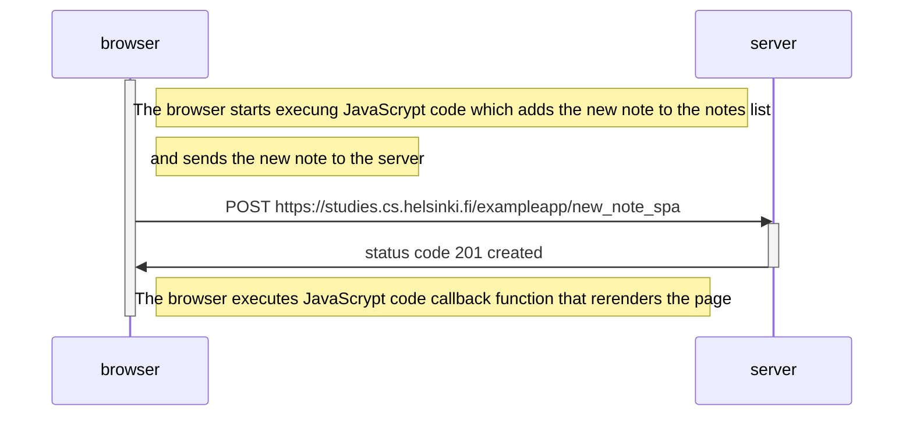

# Diagram 

This diagram depicting the situation where the user creates a new note on the single-page app version of the notes app at https://studies.cs.helsinki.fi/exampleapp/spa by writing something into the text field and clicking the submit button.

